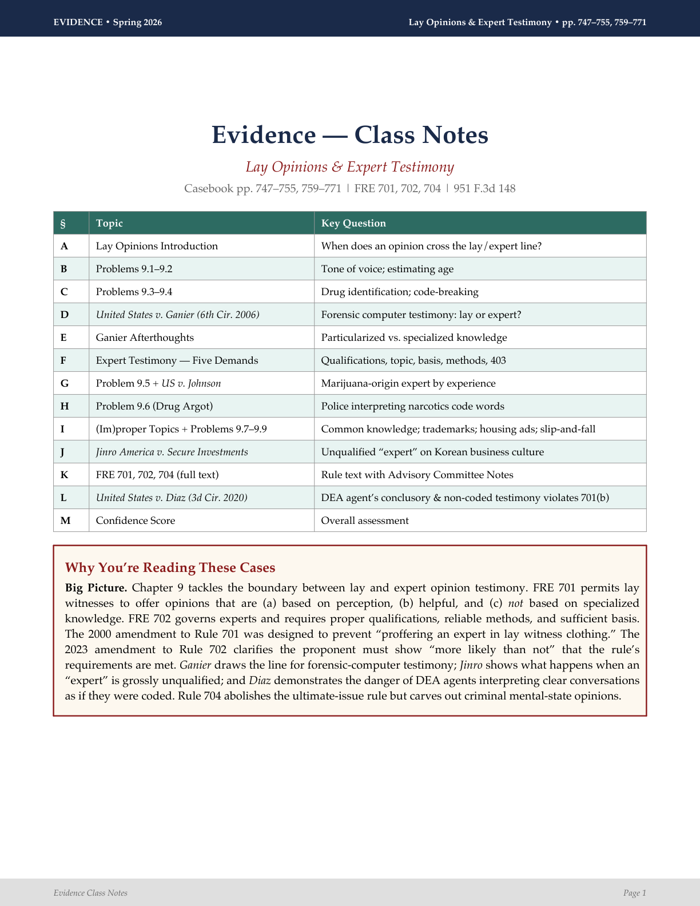
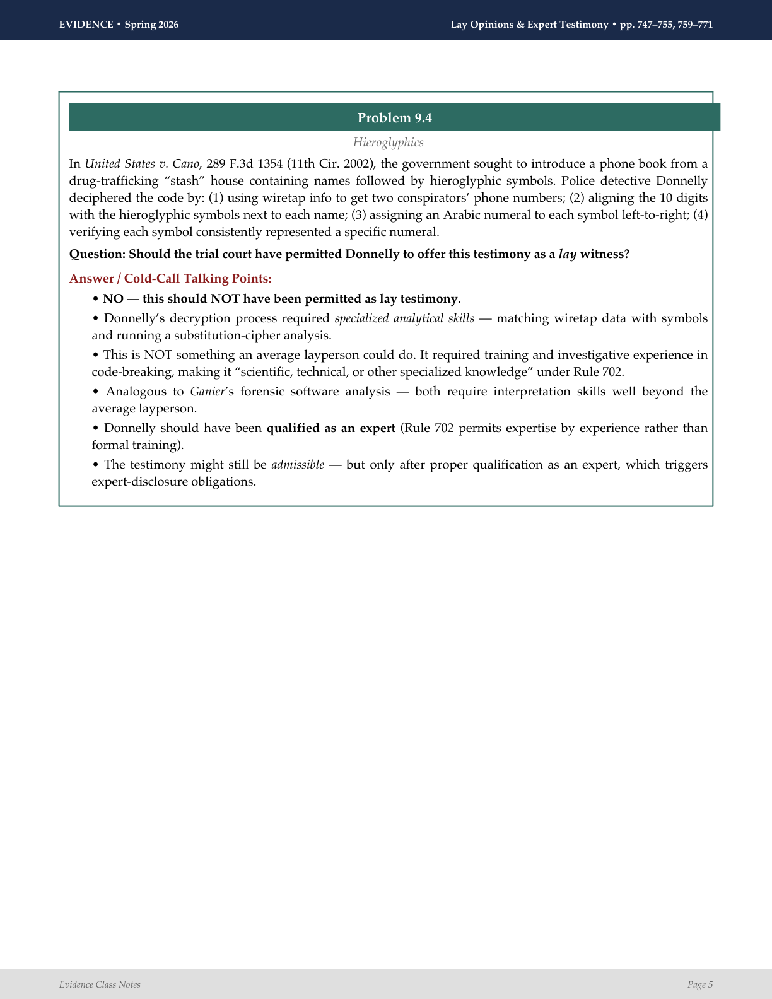
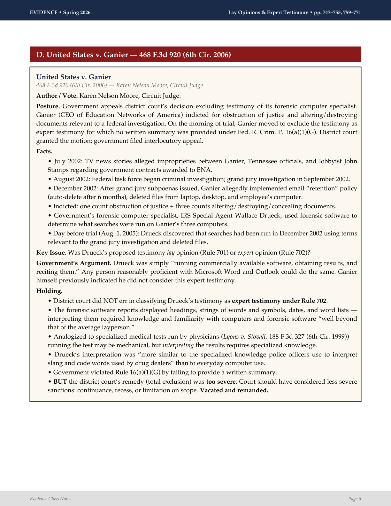

# cold-call-ready

[](https://www.python.org/downloads/)
[](https://pypi.org/project/reportlab/)
[](LICENSE)
[](#one-time-setup-5-minutes)
[](#how-to-use-it)
[](https://claude.ai)
[](https://chat.openai.com)
[](https://gemini.google.com)
[](https://github.com/gabrielmeir53/cold-call-ready/pulls)

**Never get caught flat-footed in class again.**

Upload your casebook reading to Claude, ChatGPT, or Gemini. Paste a prompt. Get a polished, color-coded PDF with every case briefed, every problem answered, and cold-call Q&A boxes telling you exactly what to say when the professor points at you.

No coding required. Built for law school.

---

## What You Get

A 20+ page PDF for each reading assignment:

<p align="center">
  
  &nbsp;&nbsp;
  
</p>
<p align="center">
  <em>Left: Title page with TOC and "Why You're Reading" box. Right: Full case brief with facts, holding, and reasoning.</em>
</p>

<p align="center">
  
</p>
<p align="center">
  <em>Cold-call Q&A box with professor questions and bullet-point answers you can say out loud.</em>
</p>

Every PDF includes:

- **Case briefs** -- facts, holding, reasoning, key quotes, all in a styled box
- **Cold-call Q&A** -- likely professor questions with bullet-point answers ready to recite
- **Problem answers** -- every textbook question answered with talking points
- **Rule text** -- FRE rules, statutes, constitutional provisions in highlighted boxes
- **Comparison tables** -- majority vs. dissent, old rule vs. new rule, element breakdowns
- **Confidence score** -- tells you how well-covered you are section by section
- **PDF bookmarks** -- jump to any case or section from the sidebar

All in Palatino on letter-sized pages. Nothing splits awkwardly across pages.

---

## How to Use It

### One-time setup (5 minutes)

**1. Make sure you have Python.**

<table>
<tr><td><strong>Mac</strong></td><td>Open <strong>Terminal</strong> and type <code>python3 --version</code>. If you see a version number, you're good.</td></tr>
<tr><td><strong>Windows</strong></td><td>Open <strong>Command Prompt</strong> or <strong>PowerShell</strong> and type <code>python --version</code>. If you see a version number, you're good.</td></tr>
</table>

If Python isn't installed, download it from [python.org/downloads](https://www.python.org/downloads/). **Windows users:** check "Add Python to PATH" during installation.

**2. Install one library.**

```bash
pip install reportlab
```

(On Mac, use `pip3` if `pip` doesn't work.)

**3. Download this repo.**

If you have Git installed:
```bash
git clone https://github.com/gabrielmeir53/cold-call-ready.git
```

If you don't have Git: click the green **Code** button at the top of [this page](https://github.com/gabrielmeir53/cold-call-ready), then **Download ZIP**. Unzip it wherever you like.

**4. Font (automatic).**

Palatino is auto-detected on your system:
- **Mac** -- already installed at `/System/Library/Fonts/Palatino.ttc`. Nothing to do.
- **Windows** -- auto-detected if Palatino is in `C:\Windows\Fonts`. If not installed, it falls back to **Times** automatically. Your notes will still look great.
- **Linux** -- checks common font directories. Falls back to Times if not found.

No font configuration is required. It just works.

---

### Before each class (~5 minutes)

**1. Open your AI tool.** Pick whichever you have access to (see [CLI workflows](#using-the-cli-claude-code-or-codex) below if you're using the terminal):

<table>
<tr><th colspan="2">Claude</th></tr>
<tr><td><strong>Claude Desktop</strong> (Mac/Windows)</td><td><a href="https://claude.ai/download">Download here</a> -- use the "Analysis" tool or Claude Code from within the app</td></tr>
<tr><td><strong>Claude Code CLI</strong></td><td>Install via <code>npm install -g @anthropic-ai/claude-code</code>, then run <code>claude</code> in Terminal</td></tr>
<tr><td><strong>Claude Code in VS Code / JetBrains</strong></td><td>Install the Claude Code extension from the marketplace</td></tr>
<tr><th colspan="2">ChatGPT</th></tr>
<tr><td><strong>ChatGPT with Code Interpreter</strong></td><td>Use <a href="https://chat.openai.com">chat.openai.com</a> (Plus/Team/Enterprise). Upload <code>note_generator.py</code> alongside your reading.</td></tr>
<tr><td><strong>Codex CLI</strong></td><td>Install via <code>npm install -g @openai/codex</code>, then run <code>codex</code> in Terminal. See <a href="#using-the-cli-claude-code-or-codex">CLI workflow</a>.</td></tr>
<tr><th colspan="2">Gemini</th></tr>
<tr><td><strong>Gemini Advanced</strong></td><td>Use <a href="https://gemini.google.com">gemini.google.com</a> (requires Google One AI Premium). Upload <code>note_generator.py</code> alongside your reading.</td></tr>
<tr><td><strong>Google AI Studio</strong></td><td>Use <a href="https://aistudio.google.com">aistudio.google.com</a> (free). Has built-in code execution.</td></tr>
</table>

> **ChatGPT / Gemini users:** You must upload `note_generator.py` from this repo into the chat along with your reading, since the AI's sandbox doesn't have access to your local files. The AI will generate a PDF you can download directly from the chat.

> **Web-only users:** [claude.ai](https://claude.ai), [chat.openai.com](https://chat.openai.com), and [gemini.google.com](https://gemini.google.com) can all analyze your reading and write the script, but the browser versions may not run Python. Copy the generated script, save it as `notes.py`, and run it yourself in Terminal.

**2. Upload your reading.** Attach the PDF of the casebook pages your professor assigned.

**3. Open `PROMPT_TEMPLATE.md`** from the repo you downloaded. Copy everything under **"Master Prompt"** (the big block inside the triple backticks).

**4. Paste it into the chat.** Replace three things:

| Replace this | With this |
|---|---|
| `[CLASS NAME]` | Your course -- e.g., `Evidence` |
| `[PAGES/FILE DESCRIPTION]` | What you uploaded -- e.g., `the attached PDF, pp. 747-755` |
| `[CLASS-SPECIFIC INSTRUCTIONS]` | A block from the bottom of `PROMPT_TEMPLATE.md` for your class *(optional but recommended)* |

Delete the `[PALATINO FONT PATH]` line entirely -- it auto-detects.

**5. Send it.** The AI reads your casebook pages, analyzes every case and problem, and writes a Python script that generates the PDF.

**6. Run it.**
- **Claude Code / Codex CLI** -- runs automatically. PDF saved to your current folder.
- **ChatGPT Code Interpreter / Gemini** -- runs automatically. Download the PDF from the chat.
- **Everyone else** -- copy the generated script, save it as `notes.py`, and run it yourself:

```bash
python notes.py
```

**7. Open the PDF.** You're ready for class.

---

### Using the CLI (Claude Code or Codex)

Both Claude Code and OpenAI Codex are terminal-based AI tools that can read files directly from your machine -- no uploading needed. The workflow is nearly identical for both.

#### Install

| Tool | Install command | Run command |
|---|---|---|
| **Claude Code** | `npm install -g @anthropic-ai/claude-code` | `claude` |
| **Codex CLI** | `npm install -g @openai/codex` | `codex` |

Both require [Node.js](https://nodejs.org/) (which includes `npm`). If you don't have Node, download the LTS version from [nodejs.org](https://nodejs.org/).

#### Step-by-step

**1. Open Terminal and `cd` into the repo folder.**

```bash
# Mac / Linux
cd ~/cold-call-ready

# Windows (Command Prompt)
cd %USERPROFILE%\cold-call-ready

# Windows (PowerShell)
cd ~\cold-call-ready
```

If you cloned somewhere else, use that path instead. The key is that `note_generator.py` must be in your current directory.

**2. Start the CLI.**

```bash
claude          # if using Claude Code
codex           # if using Codex
```

**3. Reference your reading by file path.**

Instead of uploading a PDF, tell the AI where the file is. In the prompt, replace `[PAGES/FILE DESCRIPTION]` with the file path:

```
# If the reading is in the same folder:
I have uploaded reading.pdf for my Evidence class.

# If the reading is somewhere else, use the full path:
I have uploaded /Users/yourname/Documents/Evidence/Chapter12.pdf for my Evidence class.

# On Mac with spaces in the path, just write it naturally:
I have uploaded ~/Documents/Spring 2026/Evidence/pp747-755.pdf for my Evidence class.

# On Windows:
I have uploaded C:\Users\yourname\Documents\Evidence\Chapter12.pdf for my Evidence class.
```

> **Tip:** You can drag a file from Finder (Mac) or File Explorer (Windows) into the terminal window to paste its full path automatically.

**4. Paste the rest of the prompt as normal** -- the Master Prompt from `PROMPT_TEMPLATE.md` with your `[CLASS NAME]` and `[CLASS-SPECIFIC INSTRUCTIONS]` filled in.

**5. The AI reads the file, writes the script, and runs it automatically.** The PDF appears in your current directory. No copy-pasting scripts or manual `python` commands needed.

<details>
<summary><strong>Example: full Claude Code session</strong></summary>

```bash
$ cd ~/cold-call-ready
$ claude

> I have uploaded ~/Documents/Evidence/pp747-755.pdf for my Evidence class.
>
> === READING & ANALYSIS ORDER ===
> [... rest of the Master Prompt ...]
>
> === CLASS-SPECIFIC: EVIDENCE ===
> [... Evidence block from PROMPT_TEMPLATE.md ...]

# Claude reads the PDF, writes the script, runs it, and saves the PDF.
# You'll see something like:
# ✓ Created "Evidence - Hearsay Exceptions pp. 747-755.pdf"
```

</details>

<details>
<summary><strong>Example: full Codex session</strong></summary>

```bash
$ cd ~/cold-call-ready
$ codex

> I have uploaded ~/Documents/Evidence/pp747-755.pdf for my Evidence class.
>
> === READING & ANALYSIS ORDER ===
> [... rest of the Master Prompt ...]
>
> === CLASS-SPECIFIC: EVIDENCE ===
> [... Evidence block from PROMPT_TEMPLATE.md ...]

# Codex reads the PDF, writes the script, runs it, and saves the PDF.
```

</details>

---

### Class-specific prompts

At the bottom of `PROMPT_TEMPLATE.md`, there are pre-built instruction blocks you can paste into `[CLASS-SPECIFIC INSTRUCTIONS]` to tailor the output:

| Class | What it adds |
|---|---|
| **Evidence** | Reads problems first, gives admissibility verdicts with FRE subsections, tracks 2000/2023 amendments |
| **Immigration Law** | Step-by-step logical walkthroughs, covers all visa types and INA sections, builds doctrinal timelines |
| **Internet Law** | Full case summaries with judge names, dissents at equal depth, policy-oriented cold-call questions |
| **Wills, Trusts & Estates** | Extra charts and diagrams, financial data tables, UTC/UPIA/UPC cross-references |
| **Custom** | Blank template with guiding questions to build your own |

---

## FAQ

**Do I need to know Python?**
No. The AI writes and runs the script for you. You just paste a prompt.

**Does it work on Windows?**
Yes. Python + ReportLab work on Windows. The font auto-detects Palatino if installed, otherwise falls back to Times.

**Can I use it for non-law classes?**
Yes. The components (case briefs, tables, Q&A boxes) work for any subject. Write your own class-specific instruction block.

**What if I want to tweak the output?**
Ask the AI to adjust anything -- colors, layout, content. Or see the [API Reference](#for-developers) below to write scripts by hand.

**Does it work with ChatGPT?**
Yes. Use ChatGPT with Code Interpreter (requires Plus, Team, or Enterprise). Upload `note_generator.py` and your reading together, paste the prompt, and it generates the PDF in the sandbox. You download it straight from the chat.

**Does it work with Gemini?**
Yes. Use Gemini Advanced or Google AI Studio. Same workflow -- upload `note_generator.py` and your reading, paste the prompt. AI Studio is free and has built-in code execution.

**Which AI is best?**
All three work. Claude Code is the smoothest because it runs locally and saves the PDF to your machine automatically. ChatGPT and Gemini are convenient if you already have a subscription -- just download the PDF when it's done. Use whichever you have access to.

**How much does it cost?**
This repo is free (MIT license). You need a Claude, ChatGPT, or Gemini account to use the AI workflow.

---

## Troubleshooting

**"ModuleNotFoundError: No module named 'reportlab'"**
You haven't installed the library yet. Run `pip install reportlab` (or `pip3 install reportlab` on Mac).

**"No such file or directory" when running the script**
Make sure the script and `note_generator.py` are in the same folder. If you downloaded the ZIP, `cd` into the unzipped folder first.

**The PDF has wrong fonts / looks different than the screenshots**
Palatino wasn't found on your system, so it fell back to Times. This is fine -- Times still looks professional. If you want Palatino on Windows, install it from a font provider or copy `Palatino.ttc` from a Mac.

**The generated script errors out**
Paste the error message back into the chat and ask the AI to fix it. Common causes: a typo in the generated script, or a ReportLab version mismatch. Make sure you have `reportlab >= 4.0` (`pip install --upgrade reportlab`).

**The PDF is blank or has only one page**
The script probably errored silently. Run it in Terminal/Command Prompt directly (`python my_notes.py`) to see the full error output.

**Content is split across pages**
This shouldn't happen -- `KeepTogether` prevents it. If it does, ask the AI to wrap the offending section in a `KeepTogether` block, or reduce the content length so it fits on one page.

**ChatGPT / Gemini says it can't find `note_generator.py`**
You need to upload `note_generator.py` into the chat alongside your reading. The AI's sandbox can't access files on your computer.

**"WARNING: Palatino font not found -- using Times as fallback"**
Not an error -- just informational. Your PDF will use Times instead of Palatino. To suppress: install Palatino or set `NOTE_GEN_FONT_PATH` to your font file.

---

## For Developers

<details>
<summary><strong>API Reference</strong> -- click to expand</summary>

### Manual Usage

If you prefer to write the script by hand, use the `NoteBuilder` API directly:

```python
from note_generator import NoteBuilder

nb = NoteBuilder(
    output_path="my_notes.pdf",
    class_name="Evidence",
    topic_title="Hearsay Exceptions",
    page_range="pp. 400-430",
    semester="Fall 2025"
)

nb.add_section("A. Present Sense Impression")
nb.add_text("Under FRE 803(1), a statement describing an event ...")

nb.add_case_brief(
    "Crawford v. Washington",
    "541 U.S. 36 (2004) -- Scalia, J.",
    [
        ("Holding.", "Testimonial statements require confrontation ..."),
        ("Reasoning.", [
            "The Roberts reliability test gave courts too much discretion.",
        ]),
    ]
)

nb.add_cold_call("COLD-CALL POINTS -- Crawford", [
    ("What did Crawford change?", [
        "Replaced Roberts with a bright-line confrontation rule.",
    ]),
])

nb.add_confidence_score([
    ["OVERALL", "93%", "Review forfeiture-by-wrongdoing."],
])

nb.build()
```

### Methods

| Method | Description |
|---|---|
| `NoteBuilder(output_path, class_name, topic_title, page_range, font_path=None, semester=None)` | Create a new PDF builder |
| `.add_title_page(subtitle, page_ref, toc_data, why_title, why_text)` | Title + TOC + "Why" box |
| `.add_section(title)` | Maroon section header with bookmark |
| `.add_subsection(title)` | Teal subsection header with bookmark |
| `.add_text(text)` | Body paragraph (supports `<b>`, `<i>` HTML) |
| `.add_case_brief(title, citation, fields)` | Bordered case brief box |
| `.add_cold_call(title, qa_pairs)` | Cold-call Q&A box |
| `.add_problem(number, title, facts, question, answer_bullets)` | Problem with answer |
| `.add_table(headers, rows, col_widths=None)` | Colored info table |
| `.add_rule_box(rule_title, rule_text_parts)` | Styled rule/statute box |
| `.add_info_box(title, text)` | Bordered info box |
| `.add_confidence_score(rows)` | Confidence score table |
| `.add_page_break()` | Page break |
| `.add_spacer(height=6)` | Vertical spacer |
| `.build()` | Build the PDF with bookmarks |

All methods return `self` for chaining: `nb.add_section("A").add_text("...").add_page_break()`

### Font Configuration

Palatino is auto-detected in this order:
1. `NOTE_GEN_FONT_PATH` environment variable
2. macOS: `/System/Library/Fonts/Palatino.ttc`
3. Linux: `/usr/share/fonts/truetype/Palatino.ttc` and common alternatives
4. Windows: `C:\Windows\Fonts\pala.ttf`
5. Fallback: Times-Roman (built into ReportLab)

### Colors

| Name | Hex | Usage |
|---|---|---|
| Navy | `#1B2A4A` | Header bar, title text |
| Teal | `#2E6B62` | Subsection headers, table headers |
| Maroon | `#8B1A1A` | Section headers, cold-call titles |
| Cream | `#FDF8F0` | Case brief backgrounds |
| Teal Light | `#E8F4F2` | Alternating table rows |

```python
from note_generator import COLORS
print(COLORS["NAVY"])  # HexColor('#1B2A4A')
```

</details>

---

## Contributing

PRs welcome. If you add a new component, follow the existing pattern: return a ReportLab `Flowable`, accept an optional `content_w` parameter, and add a corresponding `NoteBuilder` method.

## License

[MIT](LICENSE)
